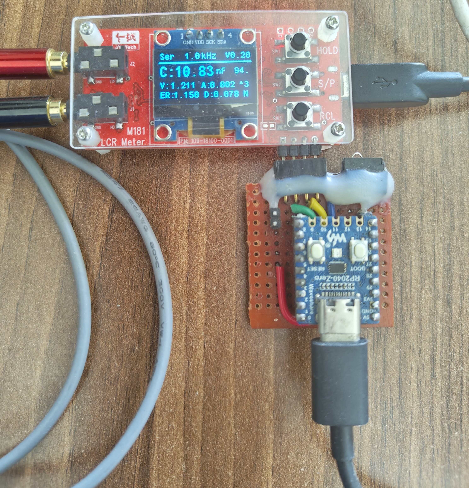
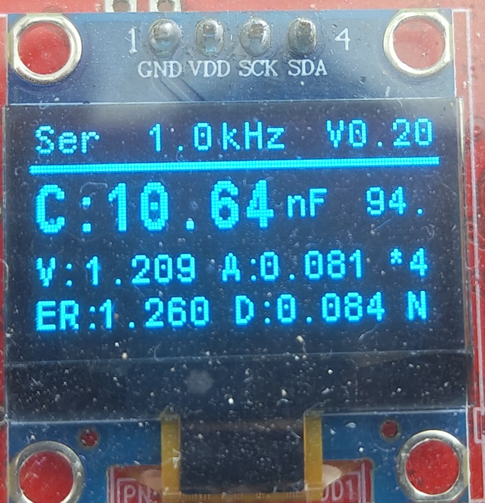

# Goal
   To Develop only the Firmware for M181 LCR Meter made by JyeTech. Hope to provide understanding in basics of LCR Meter.

**Note**: Still this firmware under development.

## Hardware - M181 LCR Meter 
- Official product page link [here](https://jyetech.com/m181-lcr-meter/)
- I have purchased from Banggood, buying link is [here](https://www.banggood.in/Jyetech-M181-LCR-Meter-18101K-DIY-Kit-100Hz-1KHz-Test-Frequency-High-precision-Small-Value-Inductance-Resistance-and-Capacitance-Measurement-Module-reviews-p2017117.html)

# System Overview
## MCU programming
- Programmer → Raspberry pi debug probe (**modified)
- Interface  → SWD
- IDE        → PlatformIO
- Framework  → STM32Cube

**Programming setup image**

## Output parmeter

* Ser → Calculation mode Series or Parallel
* 1.0kHz → Frequency signal used for measurement
* V0.20 → Frimware Version
* C → Capacitance **Mode Change
* V → RMS Voltage across the DUT
* A → RMS Current flowing via DUT
* ER → Equivalnet Series Resistor(ESR)
* D → Dissipation factor (or) Tan Delta

***
 **Further details will be added in [Wiki page](https://github.com/Jaishankar872/LCR_Meter_Proto_M181/wiki)**
