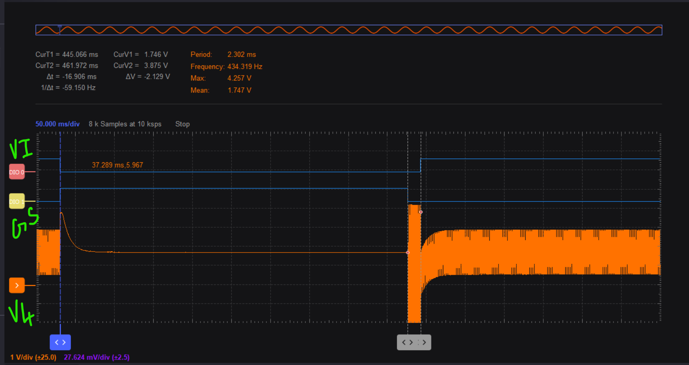
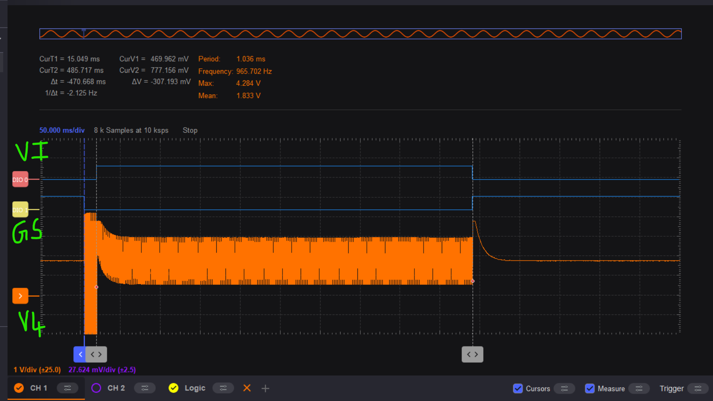
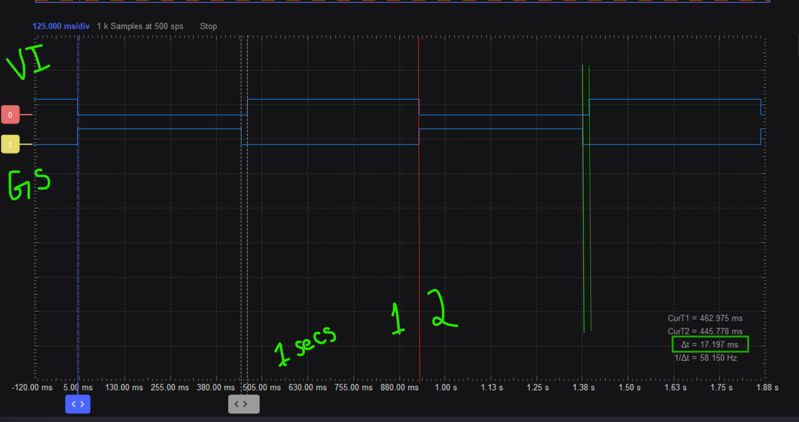
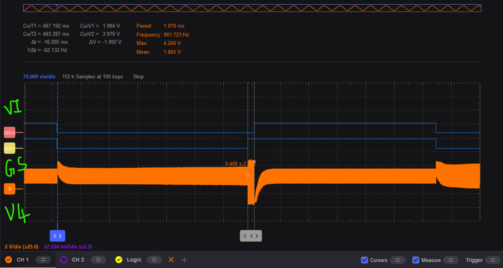

# Goal
   To Develop only the Firmware for M181 LCR Meter made by JyeTech. Hope to provide understanding in basics of LCR Meter.

*****
**Note**
 - This firmware is still under development.
 - For a fully reworked version, please refer to the firmware at [OneOfEleven/M181-LCR-Meter-Firmware](https://github.com/OneOfEleven/M181-LCR-Meter-Firmware).

*****
## Current Status
- [x] Reverse Engineer the schematics and document notes
- [x] Prepare a LTspice simulation.  <<< [Done].
- [x] Basic driver layer prepare used STM32Cube.
- [x] Solve by noise problem in ADC captured data >>> [Done] Via Goertzel
- [x] Add Low Filter and DC block <<< [Done] Goertzel + Avg.
- [x] Calculate amplitude and phase difference of Volt, Current 
- [ ] LCR forumla implementation with Mode option <<< Basic option Added
- [ ] Save the settings option in MCU memory
- [ ] Calibration mechanism 

## Hardware - M181 LCR Meter 
- Official product page link [here](https://jyetech.com/m181-lcr-meter/)
- I have purchased from Banggood, buying link is [here](https://www.banggood.in/Jyetech-M181-LCR-Meter-18101K-DIY-Kit-100Hz-1KHz-Test-Frequency-High-precision-Small-Value-Inductance-Resistance-and-Capacitance-Measurement-Module-reviews-p2017117.html)

# System Overview
## MCU programming
- Programmer → Raspberry pi debug probe (**modified)
- Interface  → SWD
- IDE        → PlatformIO
- Framework  → STM32Cube

**Programming setup image**

## Output parameter

* Ser → Calculation mode Series or Parallel
* 1.0kHz → Frequency signal used for measurement
* V0.20 → Firmware Version
* C → Capacitance **Mode Change
* V → RMS Voltage across the DUT
* A → RMS Current flowing via DUT
* ER → Equivalent Series Resistor(ESR)
* D → Dissipation factor (or) Tan Delta

## Analysis Original JYETech Firmware
### 1. With 10nF Film as a load
 Connected 10nF Capacitor as a load then capture waveform and UART serial output

> Note:
>
> 

### 2. VI/GS Pin handling (open load condition)

VI and GS Pin is not HIGH simultaneously during Open Circuit

### 3. VI/GS Pin handling (Short Circuit condition)

VI - HIGH, GS - LOW not happening during short circuit

***

# Detailed Wiki Page

 **Further details will be added in [Wiki page](https://docs.jaidb.in/m181_lcr/Home/)**
